# LightBox


LightBox is an offline learning server for schools with no reliable internet.

You install it on one Linux computer. That computer runs a web app, an AI tutor, and
a translator, all locally. Students connect to it over Wi-Fi from tablets, phones, or
laptops and open it in a browser. Nothing is installed on the student devices, and
nothing needs an internet connection once the server is set up.

## Who it is for

- Schools and learning centres with no internet, or internet that is only good enough
  for a one time download.
- Places running on donated or older hardware.
- Teachers who want to see what their students actually did, without a cloud account
  and without student data leaving the building.

## Features

- **Reading Hub.** 85 illustrated books sorted into reading levels from kindergarten
  to grade 4, with a comprehension quiz for each one.
- **Homework Helper.** A chat tutor that answers questions in plain language, powered
  by a language model running on the server itself.
- **Video lessons.** 127 maths lessons for grades K to 8 with captions.
- **Lesson quizzes.** A short quiz attached to each video lesson.
- **Ask about this lesson.** A question box on each lesson that answers using that
  lesson's transcript.
- **Unit tests.** Longer tests covering a whole topic.
- **Teacher tests.** Teachers can build their own tests, assign them to students, and
  see the results.
- **Teacher dashboard.** Class overview, per student progress, and test results.
- **Activity history.** A calendar view of what each student did and when.
- **Classes and join codes.** Students join a class with a short code. Teachers
  approve or reject requests.
- **Achievements.** Badges students earn for finishing books, lessons, and quizzes.
- **Read aloud.** Text on screen can be spoken out loud for early readers.
- **Four languages.** English, French, German, and Spanish across the whole
  interface, including the books and the tutor.
- **Accounts and progress.** Each student has a login, and their progress is stored
  on the server.

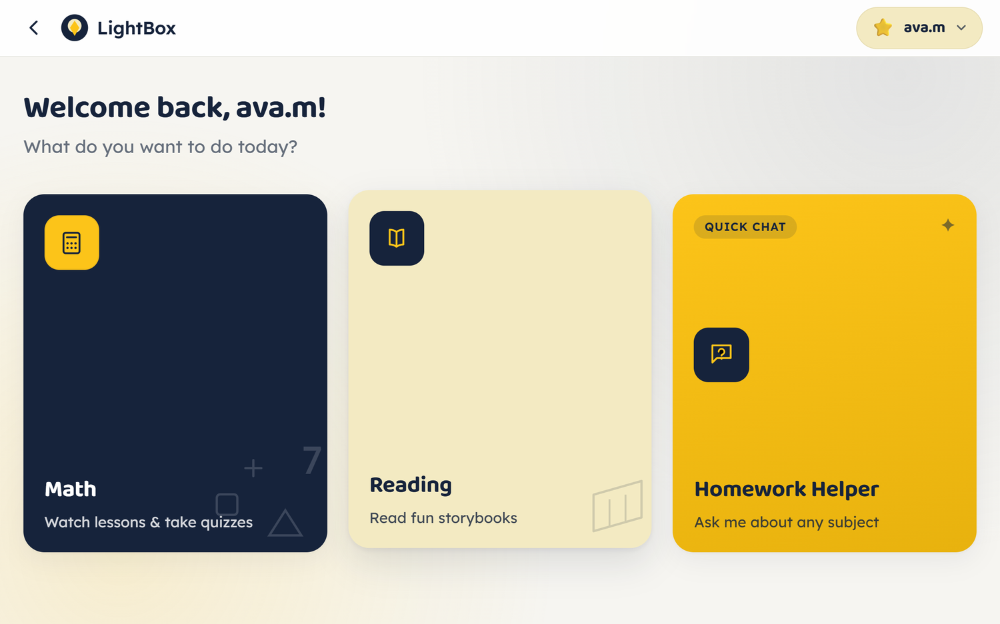

## Device tiers

Everything except the AI tutor is fast on any machine, because it is just files sent
over a local network. The tutor is what decides which tier you need.

| | Low | Medium | High |
|---|---|---|---|
| CPU | 2 cores, no AVX2 | 4 cores with AVX2 | 8 cores or more |
| RAM | 4 GB | 8 GB | 16 GB |
| Free storage | 4 GB | 8 GB | 8 GB |
| First answer after boot | about 2 minutes | about 2 minutes | under 1 minute |
| Simple question | 30 to 60 s | about 30 s | under 10 s |
| "Why" question | 45 to 90 s | about 45 s | 10 to 20 s |
| 5 students at once, worst case | 2 to 4 minutes | about 2 minutes | under 1 minute |
| Class size that stays comfortable | 3 to 5 | 5 to 10 | 15 or more |

The Medium column is the reference machine: an Intel i5-3317U with 4 threads and
8 GB of RAM, which is a 2012 laptop, running Qwen2.5-3B-Instruct at Q4_K_M. On that
machine the model takes about 111 seconds to load on the first question after boot,
then answers single questions in 27 to 45 seconds. With 5 students asking at the same
time, answers average 75 seconds and the slowest takes about 119 seconds. Nothing
fails under that load, it just queues.

Two things matter more than the rest when choosing a machine:

- **RAM over cores.** The model needs about 2.5 GB resident. If it does not fit, the
  machine starts swapping and answers take minutes instead of seconds.
- **AVX2.** A CPU without it runs the model at roughly half speed. Most machines from
  2013 onward have it.

Storage adds up to about 2.6 GB: 1.9 GB for the model, 570 MB for the video lessons,
and 90 MB for the app and books.

## Requirements

- A computer running Ubuntu or Debian Linux. This is the only supported platform for
  the server.
- Python 3.9 or newer, which the installer sets up.
- Internet access during installation only, to download packages, the model, and the
  video lessons.

Student devices need nothing but a web browser. Any phone, tablet, Chromebook, or
laptop works.

## Install

```bash
git clone https://github.com/lightboxmissions/lightbox-public.git ~/lightbox
cd ~/lightbox
bash server/install.sh
```

That one command does everything: system packages, llama.cpp, the language model,
LibreTranslate, the video lessons, and three background services that start
automatically when the machine boots. It is safe to run again, since it skips
anything already done.

Expect 20 to 60 minutes on a slow machine. Most of that is building llama.cpp and
downloading the model and videos.

When it finishes it prints the address to open, for example `http://192.0.2.10:8090`.

### First run

1. Open the address the installer printed, in a browser on the server itself or on
   any device on the same network.
2. Pick the language the school will use, then press Continue. This only appears the
   first time anyone opens LightBox.
3. Choose "Create an account" and make yourself a teacher account with a username and
   a password. Keep the password somewhere safe, since it is what gets you into the
   teacher dashboard.
4. Create your first class from the dashboard. It is given an access code.
5. Give students the access code and the address.

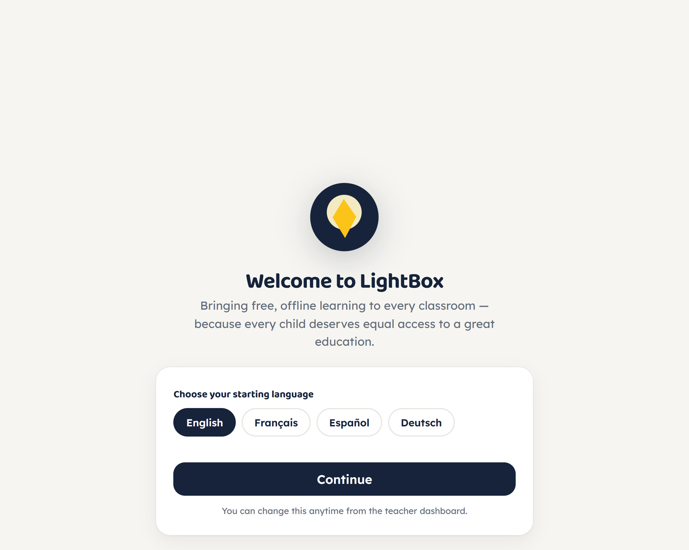

### Connecting student devices

The server listens on port 8090 on every network interface, so any device on the same
network can reach it.

If there is no network in the building, the server can be the access point:

```bash
nmcli device wifi hotspot ssid lightbox password choose-something
```

Students join that Wi-Fi, open the address, and they are in. There is no internet
involved at any point.

## Usage

### For students

**Signing in.**
On the welcome screen a student picks "I'm a Student", then either signs in with a
username and password or creates an account. To join a class they enter the join code
the teacher gave them. The teacher approves the request from the dashboard, and after
that the student sees their class work.

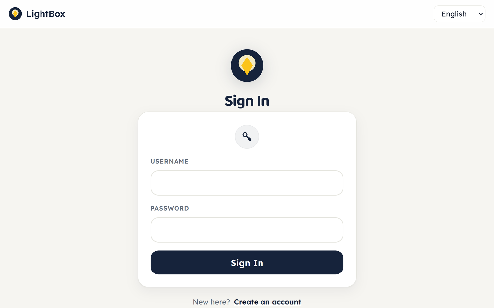

**Reading Hub.**
Books are grouped by reading level, from kindergarten up to grade 4. A student picks
a level, then a book cover. The book opens one spread at a time, with the picture and
the text for that page together, and arrows to move forward and back. There is a read
aloud button for students who are still learning to decode words.

At the end of a book there is a short comprehension quiz, usually about five
questions. Finishing it marks the book complete and counts toward a badge.

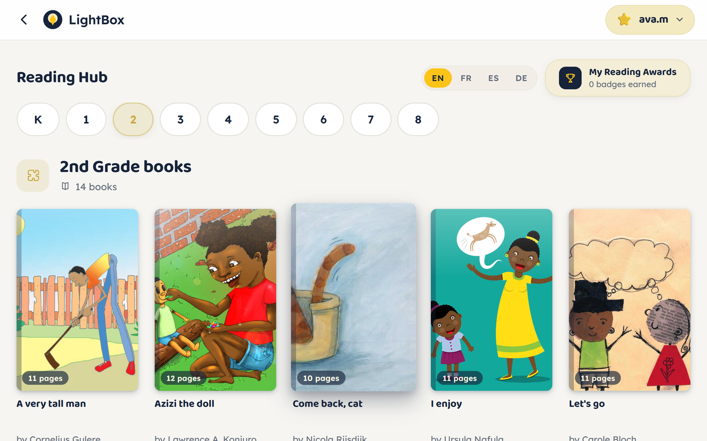

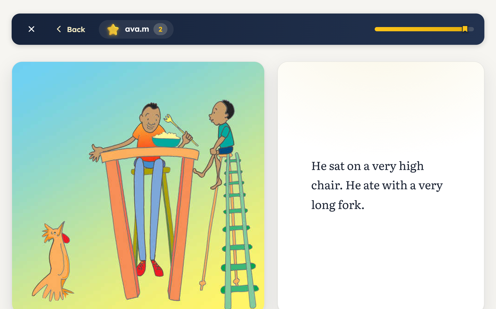

**Homework Helper.**
This is the chat tutor. The student opens it and is asked two questions first: which
subject, and which grade. Both are picked by tapping a card, not by typing. Once both
are set, a status bar at the top shows the choices and the question box appears.

The student types a question in their own words, in whichever language the interface
is set to, and the tutor answers. The conversation stays on screen, so a student can
ask a follow up without repeating themselves. The subject and grade can be changed at
any time with the Change button, which does not clear the conversation.

Answers take time. On the reference machine a simple question takes about 30 seconds
and a "why" question about 45 seconds, and the first question after the server boots
takes around two minutes while the model loads. A thinking indicator is shown the
whole time.

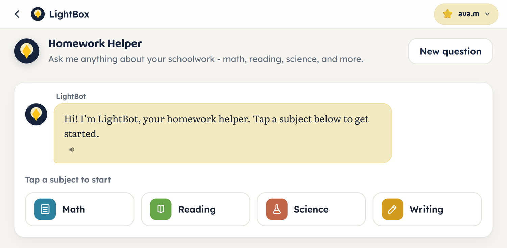

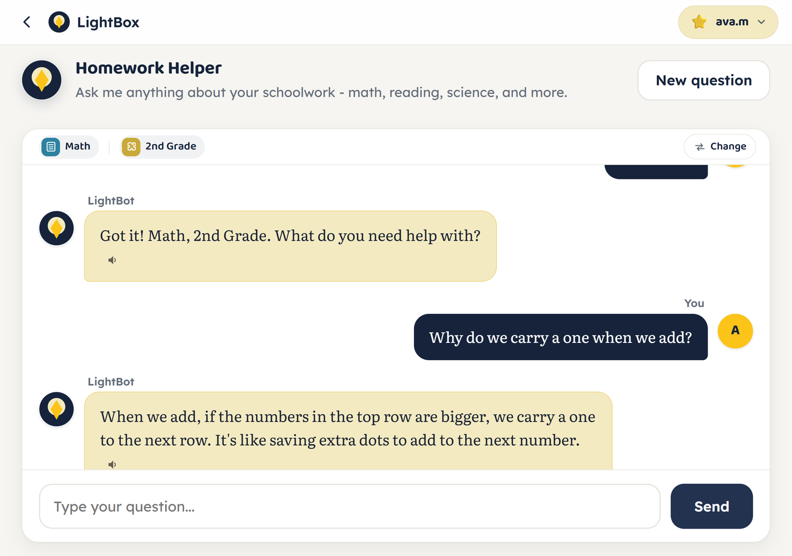

**Video lessons.**
Lessons are browsed by grade, then by topic. Each lesson plays with captions. Under
the video there is a question box that answers using that lesson's transcript, so a
student can ask what a word meant without leaving the page. After the video there is
a short quiz.

Lesson titles are listed even when the video files are not installed, because the
lesson list is part of the app. If a lesson will not play, the videos have not been
downloaded yet. See "Lesson videos" above.

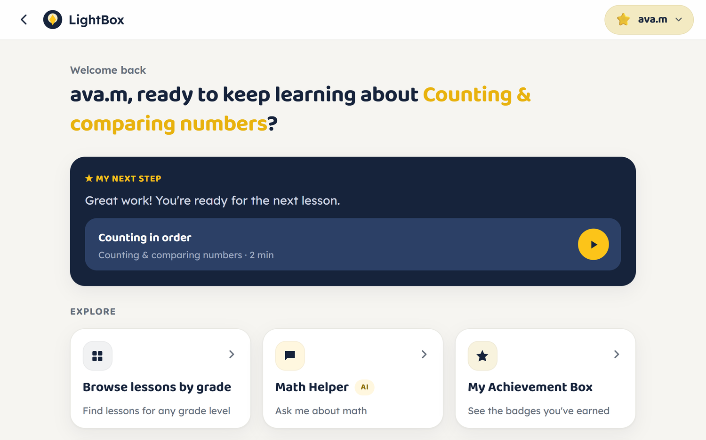

**Tests.**
Tests a teacher has assigned appear on the student's home screen. A test is a list of
questions, answered one at a time, and it is marked as soon as it is submitted.

**Achievements.**
Badges are earned for finishing books, lessons, and quizzes. The achievements screen
shows what has been earned and what is still available.

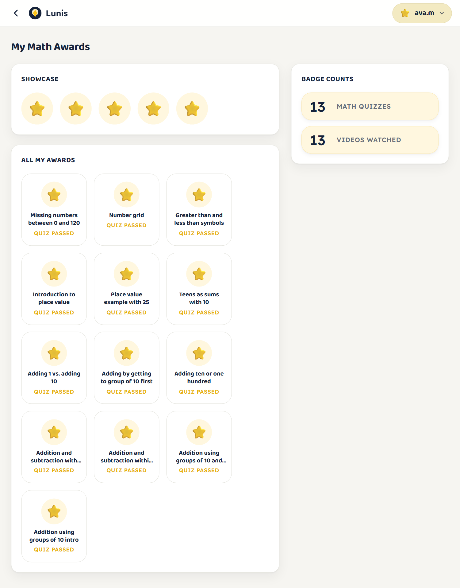

**Changing language.**
The language selector switches the whole interface, the books, and the tutor between
English, French, German, and Spanish. A student's choice is remembered.

### For teachers

**The dashboard.**
Sign in as a teacher with the password set during first run. The dashboard has three
sections: Overview, Progress, and Tests.

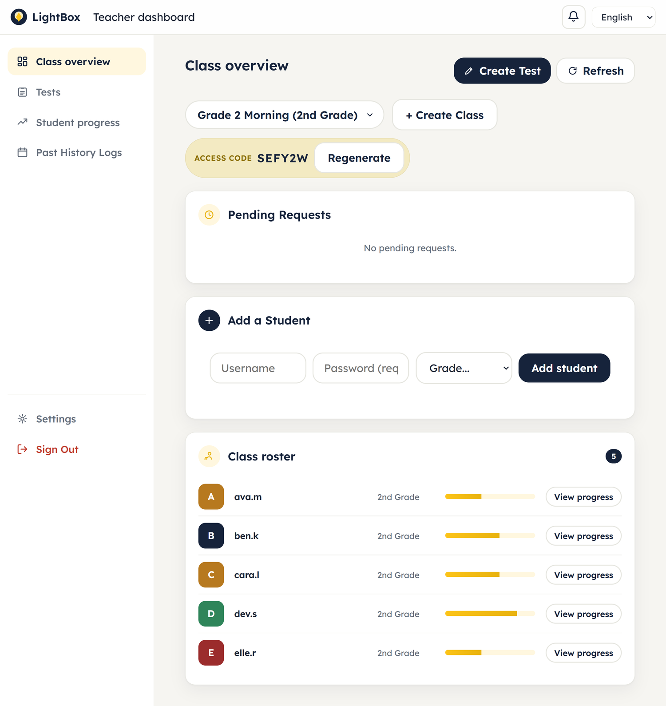

**Classes and students.**
Create a class and it is given a join code. Share that code with the class. Students
who enter it appear as pending requests, and you approve or reject each one. You can
also add a student directly, set a student's grade, remove a student, and regenerate
the join code if it has been shared too widely.

**Progress.**
The Progress section shows each student and what they have completed: lessons
watched, books finished, quiz scores. The activity history is a calendar, so you can
see which days a student worked and open any day to see exactly what they did.

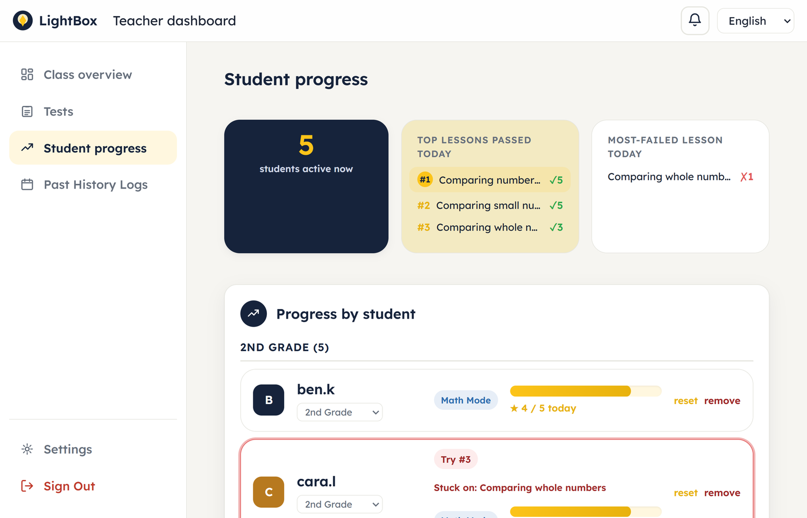

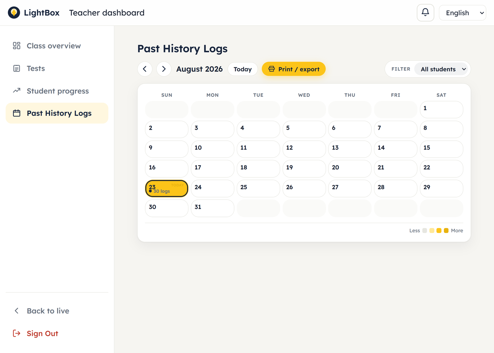

**Tests.**
Build a test by writing questions and answers, then assign it to specific students.
Results come back as students submit. You can extend a due date, update a test, or
delete one. Notifications tell you when work has been handed in.

**Settings.**
Settings covers the teacher password and how long student records are kept before
being cleared.

## Content sources

The educational content is not written by this project except where noted. It comes
from three outside sources, all of which allow redistribution.

**Reading books, 85 titles under `books/`.**

| Source | Titles | Licence |
|---|---|---|
| African Storybook Project, via Global ASP | 30 | CC BY 4.0 |
| Pratham Books / StoryWeaver, via Global ASP | 25 | CC BY 4.0 |
| Project Gutenberg | 30 | Public domain |

Every book keeps its own author, illustrator, source URL, and licence in its data
file, and the app shows that credit on the book itself. The African Storybook and
Pratham titles are illustrated picture books. The Project Gutenberg titles are
classic chapter books such as *Alice's Adventures in Wonderland*, *The Jungle Book*,
and *Peter Pan*.

- <https://www.africanstorybook.org>
- <https://storyweaver.org.in>
- <https://www.gutenberg.org>

**Video lessons, 127 titles.**
Maths lessons for grades K to 8 from **Khan Academy**, with their captions. These are
licensed CC BY-NC-SA 4.0, which means they may be shared and adapted with credit, but
not sold and not relicensed. They are downloaded during installation rather than
stored in this repository, because that licence is not the same as the MIT licence on
the LightBox code.

- <https://www.khanacademy.org>

**Quizzes, lesson notes, and unit tests.**
Written for this project. The quiz questions, the short notes on each lesson, and the
unit tests are original, though they follow the lessons they accompany.

**Translations.**
The French, German, and Spanish text is produced by LibreTranslate running on the
server. Books translated this way are marked in their data files. The English text is
the original in every case.

Full licence details for every source are in [NOTICE.md](NOTICE.md).

## Troubleshooting

**The first answer takes about two minutes, then later ones are quicker.**
The model is being loaded into memory on the first question after the server starts.
It stays loaded after that.

**Every answer takes minutes, not just the first.**
Usually not enough memory. Run `free -g` on the server. If very little is free, the
model is being swapped in and out of RAM. 8 GB is comfortable, 4 GB is tight.

**Students cannot reach the server.**
Check that the device is on the same Wi-Fi. On the server, run `hostname -I` to
confirm the address, and check that a firewall is not blocking port 8090. Some
networks stop devices from talking to each other, which blocks this entirely; running
the server as its own hotspot avoids that.

**The tutor says it is busy.**
The server answers two questions at a time and queues the rest. Under heavy use a
question can wait longer than the timeout. More memory and more cores help, and so
does a smaller group asking at once.

**Text stays in English after switching language.**
The translator builds its cache the first time each language is used. Check it is
running:

```bash
systemctl --user status lightbox-translate
```

**The installer stops while building llama.cpp.**
Usually not enough memory to compile. Build it by hand with fewer parallel jobs:

```bash
cmake --build ~/llama.cpp/build -j 2
```

**The video lessons are missing.**
The download can fail on a weak connection. Everything else still works. Retry with:

```bash
python3 scripts/fetch_content.py --download
```

To install them on a machine with no internet, copy the bundle onto a USB stick and
point the script at it:

```bash
LIGHTBOX_CONTENT_URL=file:///media/usb/lightbox-content.tar.gz \
    python3 scripts/fetch_content.py --download
```

**Checking the services.**

```bash
systemctl --user status lightbox lightbox-llama lightbox-translate
journalctl --user -u lightbox -n 50
```

## FAQ

**Does it need the internet?**
Only to install. After that, no.

**Does student data leave the machine?**
No. Accounts, progress, and answers are files on the server. There is no cloud
account and nothing is sent anywhere.

**Can I use it commercially?**
The LightBox code is MIT, so yes. The Khan Academy video lessons are NonCommercial,
so those may not be sold or used commercially. The books are CC BY or public domain,
so yes with credit. See [NOTICE.md](NOTICE.md).

**Can I use a different model?**
Yes. LightBox talks to llama.cpp over its OpenAI compatible API, so you can point it
at another GGUF model by changing `llama_url` and `model` in `config.json`. A larger
model will be slower on the same hardware.

**Why one server instead of an app on each device?**
The model needs about 2.5 GB of memory to run. Cheap tablets cannot do that. One
reasonable machine can serve a whole class.

**How many students can one server handle?**
For reading, videos, and quizzes, dozens. The limit is the tutor. See the device
tiers above for the comfortable class size at each level.

**Can I add my own books or lessons?**
Yes. Books live in `books/`, one folder each, with a JSON file per language. Follow
the shape of an existing book.

## Getting help

- **Something broken, or a question:** open an issue at
  <https://github.com/lightboxmissions/lightbox-public/issues>. Include what you did,
  what happened, and the output of
  `journalctl --user -u lightbox -n 50` if the server is involved.
- **Setting up a server in detail:** see [docs/SERVER_SETUP.md](docs/SERVER_SETUP.md).
- **How the pieces fit together:** see [docs/ARCHITECTURE.md](docs/ARCHITECTURE.md).
- **Changing the code:** see [docs/CONTRIBUTING.md](docs/CONTRIBUTING.md).

## Licence

The LightBox code is MIT. See [LICENSE](LICENSE).

The books and the video lessons are under their own licences, which MIT does not
cover. [NOTICE.md](NOTICE.md) lists every source and what it requires.
